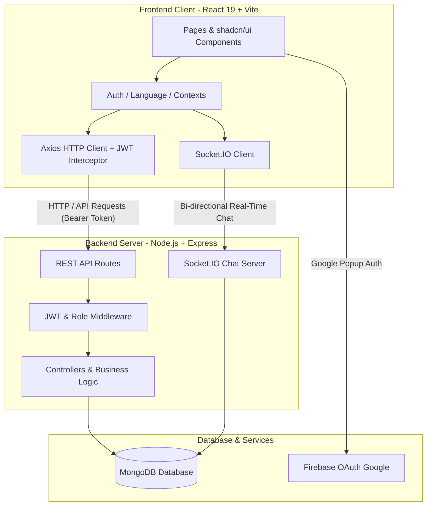
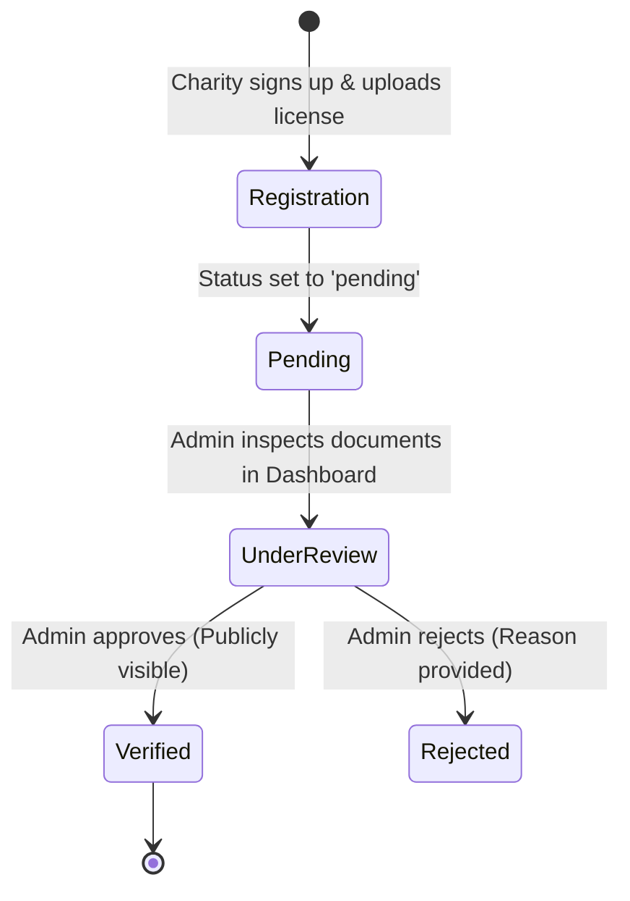

# Donation Platform (منصة الخير) — Full Project Documentation & Developer Guide

Welcome to the official, comprehensive documentation for the **Donation Platform (منصة الخير)**. Whether you are a new frontend developer joining the team, a backend engineer managing APIs, or an architect evaluating the system, this document serves as the single source of truth for understanding, running, maintaining, and expanding the platform.

---

## Table of Contents
1. [Executive Summary & System Overview](#1-executive-summary--system-overview)
2. [System Architecture & Tech Stack](#2-system-architecture--tech-stack)
3. [User Roles, Permissions & Privacy Matrix](#3-user-roles-permissions--privacy-matrix)
4. [Core Features & Workflows](#4-core-features--workflows)
5. [Database Schema & Data Models](#5-database-schema--data-models)
6. [Frontend Codebase Structure & Navigation](#6-frontend-codebase-structure--navigation)
7. [Backend API Reference & Endpoints](#7-backend-api-reference--endpoints)
8. [Setup, Installation & Environment Variables](#8-setup-installation--environment-variables)
9. [Development Commands & Scripts](#9-development-commands--scripts)
10. [Technical Gotchas & Best Practices](#10-technical-gotchas--best-practices)

---

## 1. Executive Summary & System Overview

### Vision & Mission
The **Donation Platform (منصة الخير)** is an Arabic-first, dual-language full-stack web application designed to bridge the gap between generous donors and individuals or organizations in genuine need. It digitizes the entire charitable cycle by bringing item donations, monetary fundraising campaigns, volunteer opportunities, and community aid requests under one unified, secure, and transparent digital ecosystem.

### The Problem
In many communities, charitable giving faces critical hurdles:
- **Trust Deficit:** Donors struggle to verify if organizations or individuals soliciting aid are legitimate.
- **Privacy Risks:** Direct public communication often exposes vulnerable individuals or donors to unwanted solicitations and harassment.
- **Fragmented Operations:** Charities manage volunteer schedules, physical donation intakes, and monetary fundraising across disconnected spreadsheets and social media groups.

### The Solution
The platform resolves these bottlenecks by acting as a privacy-first, verified intermediary:
- **Strict Verification Lifecycle:** Charities must undergo mandatory admin verification before their profiles and campaigns become publicly visible.
- **Privacy-Restricted Messaging:** Donors cannot directly message unverified individuals or other donors. Communication is strictly governed by role-based access control (RBAC).
- **All-in-One Hub:** Donors can give physical items (clothing, furniture, food), contribute to monetary campaigns, or volunteer their time from a single dashboard.

---

## 2. System Architecture & Tech Stack

The application follows a modern **MERN-like architecture** (MongoDB, Express.js, React 19, Node.js), decoupled into two distinct packages: a React single-page application (SPA) and an Express REST API backend with real-time WebSocket capabilities.



### Core Technologies
| Layer | Technology | Version / Details | Purpose |
| :--- | :--- | :--- | :--- |
| **Frontend Framework** | React + Vite | React 19, Vite 5+ | Ultra-fast client rendering and modular component design |
| **Styling & UI** | Tailwind CSS v4 | `@tailwindcss/vite` plugin | Zero-config utility-first styling with RTL support |
| **UI Primitives** | shadcn/ui + Radix + MUI 7 | Custom accessible components | High-control, customizable UI building blocks |
| **Routing** | React Router v7 | Object-based routing | Dynamic page layouts, protected routes, URL state |
| **Backend Framework** | Node.js + Express | Express 4.x | RESTful API server handling business logic |
| **Database & ODM** | MongoDB + Mongoose | Mongoose ODM | Schema validation, relational references, indexing |
| **Real-Time Communication** | Socket.IO | v4.x | Instant messaging, chat room management, status alerts |
| **Authentication** | JWT + Firebase Auth | Custom JWT + Google OAuth | Dual authentication flow supporting secure tokens & OAuth |

---

## 3. User Roles, Permissions & Privacy Matrix

The platform employs a flexible **Unified Role Architecture** combining `role` (system access level) and `user_type` (platform persona).

### Role Definitions
1. **Donor (`role: 'user'`, `user_type: 'donor'`):**
   - Can browse campaigns, donate items, volunteer, and request community help.
   - Can initiate messaging **only** with verified charities or regarding specific item donation offers.
2. **Charity (`role: 'user'`, `user_type: 'charity'`):**
   - Must submit licensing documentation upon registration (`status: 'pending'`).
   - Once verified (`status: 'verified'`), can create monetary campaigns, post volunteer opportunities, request community donations, and respond to donor chats.
3. **Admin (`role: 'admin'`):**
   - Full oversight over the platform via the secure Admin Dashboard.
   - Responsible for approving/rejecting charity registrations, managing user bans, monitoring platform analytics, and resolving submitted content reports.

### Privacy & Access Control Matrix
| Action / Feature | Donor | Unverified Charity | Verified Charity | Admin |
| :--- | :---: | :---: | :---: | :---: |
| Browse public campaigns & donations | ✅ Yes | ✅ Yes | ✅ Yes | ✅ Yes |
| Donate physical items | ✅ Yes | ❌ No | ❌ No | ✅ Yes |
| Create monetary campaigns | ❌ No | ❌ No | ✅ Yes | ✅ Yes |
| Post volunteer roles | ❌ No | ❌ No | ✅ Yes | ✅ Yes |
| Direct chat with another Donor | ❌ **No (Privacy)** | ❌ No | ❌ No | ✅ Yes |
| Direct chat with Verified Charity | ✅ Yes | ❌ No | ✅ Yes | ✅ Yes |
| Access Admin Dashboard | ❌ No | ❌ No | ❌ No | ✅ Yes |

> [!IMPORTANT]
> **Privacy Safeguard:** Phone numbers and email addresses are stripped or hidden by default in public views and chats unless explicitly shared by the user inside a secure conversation room.

---

## 4. Core Features & Workflows

### 1. Dual Authentication & Security Flow
Users can authenticate seamlessly via two pathways:
- **Email/Password:** Standard signup with OTP (One-Time Password) email verification and JWT session generation.
- **Google OAuth:** One-click Google Sign-in handled via Firebase SDK, which synchronizes with the backend to issue a local JWT.
- **Session Persistence:** Tokens are stored in `localStorage` under the key `token`. An Axios interceptor automatically attaches `Authorization: Bearer <token>` to all outgoing HTTP requests. If a `401 Unauthorized` response occurs (excluding `/auth/me`), the token is cleared and the user is redirected to `/login`.

### 2. Charity Verification Lifecycle


### 3. Item Donations Marketplace
- Donors post physical items (clothes, furniture, food, electronics) with photos, descriptions, condition tags (*New, Like New, Gently Used*), and location maps (Leaflet).
- Users filter items by category and urgency. Donors can manage their active listings directly from their user dashboard.

### 4. Monetary Fundraising Campaigns
- Verified charities launch targeted campaigns featuring fundraising goals, progress bars, deadline countdowns, and detailed case descriptions.
- Includes simulated checkout flows for instant contribution tracking.

### 5. Real-Time Chat & Messaging System
- Built on **Socket.IO** with manual connection handling (`autoConnect: false`) triggered upon authentication.
- Chat rooms are dynamically created when a donor contacts a charity regarding an item or campaign.
- Supports real-time typing indicators, read receipts, and blocking mechanisms.

---

## 5. Database Schema & Data Models

The backend utilizes **Mongoose ODM** to manage data relationships in MongoDB. Below are the primary models and their essential fields:

### `User`
```javascript
{
  name: { type: String, required: true },
  email: { type: String, required: true, unique: true },
  password: { type: String }, // Optional if using Google Auth
  role: { type: String, enum: ['user', 'admin'], default: 'user' },
  user_type: { type: String, enum: ['donor', 'charity'], default: 'donor' },
  status: { type: String, enum: ['pending', 'verified', 'rejected', 'banned'], default: 'verified' },
  wishlist: [{ type: Mongoose.Schema.Types.ObjectId, ref: 'Donation' }],
  charityDetails: {
    licenseNumber: String,
    description: String,
    documentUrl: String
  }
}
```

### `Donation` (Physical Items)
```javascript
{
  title: { type: String, required: true },
  description: { type: String, required: true },
  category: { type: String, enum: ['clothes', 'food', 'furniture', 'electronics', 'books', 'other'] },
  condition: { type: String, enum: ['new', 'like_new', 'good', 'fair'] },
  images: [{ type: String }],
  donor: { type: Mongoose.Schema.Types.ObjectId, ref: 'User', required: true },
  status: { type: String, enum: ['available', 'reserved', 'completed'], default: 'available' },
  location: { address: String, lat: Number, lng: Number }
}
```

### `Campaign` (Monetary Fundraising)
```javascript
{
  title: { type: String, required: true },
  description: { type: String, required: true },
  targetAmount: { type: Number, required: true },
  currentAmount: { type: Number, default: 0 },
  charity: { type: Mongoose.Schema.Types.ObjectId, ref: 'User', required: true },
  deadline: { type: Date },
  status: { type: String, enum: ['active', 'completed', 'cancelled'], default: 'active' }
}
```

### `Conversation` & `Message`
```javascript
// Conversation
{
  participants: [{ type: Mongoose.Schema.Types.ObjectId, ref: 'User' }],
  relatedItem: { type: Mongoose.Schema.Types.ObjectId, refPath: 'itemModel' },
  itemModel: { type: String, enum: ['Donation', 'Campaign', 'CommunityRequest'] },
  lastMessage: { type: Mongoose.Schema.Types.ObjectId, ref: 'Message' }
}

// Message
{
  conversationId: { type: Mongoose.Schema.Types.ObjectId, ref: 'Conversation' },
  sender: { type: Mongoose.Schema.Types.ObjectId, ref: 'User' },
  text: { type: String, required: true },
  readBy: [{ type: Mongoose.Schema.Types.ObjectId, ref: 'User' }],
  createdAt: { type: Date, default: Date.now }
}
```

---

## 6. Frontend Codebase Structure & Navigation

The frontend is structured cleanly within `/src` following industry-standard React feature modularization:

```text
src/
├── main.tsx                # App bootstrap & global provider wrappers
├── App.tsx                 # Router initialization
├── app/
│   ├── routes.tsx          # Object-based route definitions & layout wrapping
│   ├── pages/              # Top-level view components (Home, Donations, Dashboard, etc.)
│   ├── components/         # Reusable structural and feature components
│   │   ├── ui/             # shadcn-style raw primitive components (Button, Input, Dialog)
│   │   ├── Navbar.tsx      # Responsive header with RTL toggle & user menu
│   │   ├── Footer.tsx      # Platform links and copyright
│   │   ├── Layout.tsx      # Main wrapper encapsulating Navbar + Page Content + Footer
│   │   └── ChatDialog.tsx  # Socket.IO real-time messaging modal
│   ├── context/            # Global React Context providers
│   │   ├── AuthContext.tsx # User session, login/logout, token management
│   │   └── LanguageContext.tsx # RTL/LTR switching (Arabic/English)
│   ├── lib/                # Third-party client initializers (Firebase, Socket.IO)
│   ├── services/           # API helper modules communicating with backend
│   ├── utils/              # Axios instance configured with JWT interceptors
│   ├── hooks/              # Custom hooks (e.g., useCampaigns, useVolunteerOpportunities)
│   └── i18n/               # Translation dictionaries (en.json, ar.json)
```

### RTL & Localization Implementation
The application is built Arabic-first. When toggled via `LanguageContext`:
```javascript
document.documentElement.dir = language === 'ar' ? 'rtl' : 'ltr';
document.documentElement.lang = language;
```
> [!TIP]
> **Tailwind RTL Rule:** Always use logical spacing utilities (`ms-4` for margin-start, `me-4` for margin-end, `ps-4` for padding-start) instead of physical direction utilities (`ml-4` or `mr-4`). This ensures layout mirroring happens automatically without writing duplicate CSS.

---

## 7. Backend API Reference & Endpoints

The backend exposes a RESTful API anchored at `http://localhost:5000/api`. Below is a summary of the core modules:

| Module | Method | Endpoint | Description | Protected |
| :--- | :---: | :--- | :--- | :---: |
| **Auth** | `POST` | `/api/auth/register` | Register new user or charity account | ❌ No |
| | `POST` | `/api/auth/login` | Authenticate with email/password & return JWT | ❌ No |
| | `POST` | `/api/auth/google` | Verify Google OAuth token & login/register | ❌ No |
| | `GET` | `/api/auth/me` | Fetch currently logged-in user profile | ✅ Yes |
| **Donations** | `GET` | `/api/donations` | List all available physical donations | ❌ No |
| | `POST` | `/api/donations` | Create a new item donation listing | ✅ Yes |
| | `GET` | `/api/donations/:id` | Get detailed view of a specific item | ❌ No |
| **Campaigns** | `GET` | `/api/campaigns` | List active fundraising campaigns | ❌ No |
| | `POST` | `/api/campaigns` | Create campaign (Verified Charity only) | ✅ Yes (Charity) |
| **Chat** | `GET` | `/api/conversations` | Get all active chat threads for current user | ✅ Yes |
| | `GET` | `/api/messages/:convId`| Fetch message history for a conversation | ✅ Yes |
| **Admin** | `GET` | `/api/admin/charities/pending` | Get list of charities awaiting verification | ✅ Yes (Admin) |
| | `PUT` | `/api/admin/charities/:id/status` | Approve or reject a charity registration | ✅ Yes (Admin) |

---

## 8. Setup, Installation & Environment Variables

### Prerequisites
- **Node.js**: v18.0+ or v20.0+ recommended
- **MongoDB**: Local instance (`mongodb://localhost:27017`) or MongoDB Atlas cloud cluster

### Step 1: Clone & Install Dependencies
Since the project consists of independent frontend and backend packages, install dependencies in **both** directories:

```bash
# 1. Install frontend dependencies (root)
npm install

# 2. Install backend dependencies
cd backend
npm install
cd ..
```

### Step 2: Configure Environment Variables
Create `.env` in the root directory (Frontend):
```env
VITE_API_URL=http://localhost:5000/api
VITE_FIREBASE_API_KEY=your_firebase_api_key
VITE_FIREBASE_AUTH_DOMAIN=your_firebase_auth_domain
VITE_FIREBASE_PROJECT_ID=your_firebase_project_id
VITE_FIREBASE_STORAGE_BUCKET=your_firebase_storage_bucket
VITE_FIREBASE_MESSAGING_SENDER_ID=your_firebase_sender_id
VITE_FIREBASE_APP_ID=your_firebase_app_id
```

Create `.env` inside the `/backend` directory (Backend):
```env
PORT=5000
MONGODB_URI=mongodb://localhost:27017/donation_platform
JWT_SECRET=super_secret_jwt_key_change_in_production
CLIENT_ORIGIN=http://localhost:5173
```

---

## 9. Development Commands & Scripts

Use the table below to operate the application locally:

| Location | Command | Action / Purpose |
| :--- | :--- | :--- |
| **Root** | `npm run dev` | Launches the Vite frontend development server on **port 5173** |
| **Root** | `npm run build` | Compiles and optimizes frontend assets into `/dist` for production |
| **`/backend`** | `npm run dev` | Launches the Express backend via Nodemon on **port 5000** |
| **`/backend`** | `npm run seed` | Populates MongoDB with sample donors, charities, donations, and campaigns |
| **`/backend`** | `npm start` | Launches the backend server in production mode via `node src/server.js` |

### Quick Start Workflow
1. Open Terminal 1: Navigate to `/backend`, run `npm run seed` (first time only), then run `npm run dev`.
2. Open Terminal 2: In the root directory, run `npm run dev`.
3. Open browser at `http://localhost:5173`.

---

## 10. Technical Gotchas & Best Practices

> [!WARNING]
> **Socket.IO AutoConnect:** The Socket.IO client in `src/app/lib/socket.ts` is explicitly configured with `autoConnect: false`. Do not change this to true. The connection must be triggered manually inside `AuthContext` only after a valid JWT token is verified, ensuring unauthenticated sockets do not flood the server.

> [!NOTE]
> **Tailwind CSS v4 Configuration:** The project utilizes the modern Tailwind CSS v4 setup via `@tailwindcss/vite`. Because of this, `postcss.config.mjs` is intentionally left empty, and there is no `tailwind.config.js` file. Design tokens are defined directly via CSS variables in `src/index.css` as documented in `DESIGN.md`.

> [!TIP]
> **Axios Interceptor Safeguard:** When testing auth race conditions on page load, remember that the Axios interceptor ignores clearing the token on `401 Unauthorized` errors specifically for the `/auth/me` endpoint. This prevents premature session terminations when verifying expired tokens on startup.
